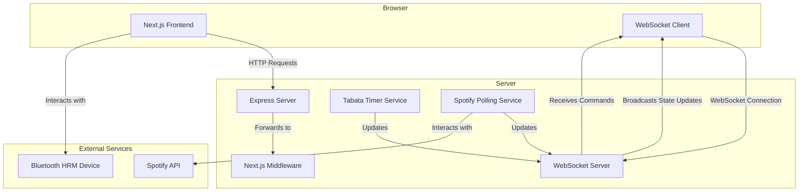

# HRM (Heart Rate Monitor) Dashboard

A real-time heart rate monitoring dashboard built with Next.js, Material-UI, WebSockets, and Spotify integration. Features a custom Express server for stateful WebSocket connections, Tabata timer with audio feedback, and live HR zone visualization.

**⚠️ Important:** This project uses a custom server entry (`server.ts`) that runs Next.js, a persistent WebSocket server, and background services. The server is stateful and **cannot be deployed on serverless platforms** like Vercel.

## Table of Contents

- [HRM (Heart Rate Monitor) Dashboard](#hrm-heart-rate-monitor-dashboard)
  - [Table of Contents](#table-of-contents)
  - [Features](#features)
  - [Quick Start](#quick-start)
    - [One-Click Start with DevContainer (Recommended)](#one-click-start-with-devcontainer-recommended)
    - [Manual Setup](#manual-setup)
    - [Production Build](#production-build)
  - [Project Structure](#project-structure)
  - [Available Commands](#available-commands)
    - [Primary Scripts](#primary-scripts)
    - [Navigation Shortcuts](#navigation-shortcuts)
    - [Testing \& Verification](#testing--verification)
  - [VS Code Integration](#vs-code-integration)
  - [Environment Variables](#environment-variables)
    - [Spotify Setup](#spotify-setup)
    - [Audio System](#audio-system)
  - [Documentation](#documentation)
  - [Architecture Overview](#architecture-overview)
    - [Custom Stateful Server](#custom-stateful-server)
    - [Real-time Data Flow](#real-time-data-flow)
    - [Architecture Diagram](#architecture-diagram)
    - [Key Services](#key-services)
  - [Development Guidelines](#development-guidelines)
  - [Contributing](#contributing)
  - [Production Readiness Focus](#production-readiness-focus)
  - [Recent Architecture Improvements](#recent-architecture-improvements)
    - [Audio System Integration](#audio-system-integration)
    - [UI/UX Enhancements](#uiux-enhancements)
    - [Production Readiness](#production-readiness)
  - [License](#license)
  - [Acknowledgments](#acknowledgments)

## Features

- **Real-time Heart Rate Monitoring** - WebSocket streaming from Bluetooth HRM devices or mock client
- **Dual-Mode Timer** - Tabata (work/rest intervals) and Stopwatch (count-up) modes with 5-second prepare countdown
- **Audio Feedback** - Original HRM beep sounds for countdown (3-2-1) and phase transitions
- **HR Zone Visualization** - Large percentage tiles with color-coded zones and user names/ages
- **Spotify Integration** - Full playback control, device selection, volume control, and now-playing display
- **Mock HRM Client** - Test interface with zone buttons, device ID, and noise simulation (available at `/client/mock`)
- **Control Panel** - Mobile-optimized UI with timer controls, Spotify controls, and configuration steppers (available at `/client/control`)
- **Bluetooth HRM Support** - Real heart rate monitor connection via Web Bluetooth API (available at `/client/connect`)
- **Visual Regression Tests** - Playwright screenshot-based testing

## 🔒 Strava Compliance & Privacy

**Data Usage Disclaimer:**
This application is a **local data generator**.

- **Live Dashboard:** The heart rate tiles and group displays shown in screenshots utilize **direct Bluetooth sensor data**. They do **not** display data fetched from Strava, complying with Strava API Brand Guidelines regarding user privacy.
- **AI Features:** Any AI/LLM integration (e.g., Gemini) analyzes strictly **local project metadata** or **locally recorded Bluetooth logs**. No data fetched from the Strava API is ever sent to AI models.
- **Strava Integration:** The Strava API is used strictly for **uploading** completed activities (Write-Only).

## Quick Start

### One-Click Start with DevContainer (Recommended)

This repository is configured with a VS Code DevContainer, which provides a fully automated, "one-click" setup.

1.  **Prerequisites**:
    - [Docker Desktop](https://www.docker.com/products/docker-desktop/) installed and running.
    - [Visual Studio Code](https://code.visualstudio.com/) with the [Dev Containers extension](https://marketplace.visualstudio.com/items?itemName=ms-vscode-remote.remote-containers).

2.  **Launch**:
    - Open the repository in VS Code.
    - Click the "Reopen in Container" button when prompted.

That's it. The container will build, install all dependencies (`pnpm install` and Playwright), and create a `.env.local` file for you. Once the container is ready, you can start the development server:

```bash
pnpm run dev
```

### Manual Setup

If you are not using the DevContainer, you can set up the project manually:

#### Prerequisites

Before setting up the project locally, ensure you have the following installed on your system:

- **Node.js** (version 18.x or higher recommended)
  - Download from [nodejs.org](https://nodejs.org/)
  - Verify installation: `node --version`

- **pnpm** (Package Manager)
  - Install globally: `npm install -g pnpm`
  - Verify installation: `pnpm --version`

- **Git**
  - Download from [git-scm.com](https://git-scm.com/)
  - Verify installation: `git --version`

#### Step-by-Step Setup Instructions

**1. Clone the Repository**

```bash
# Clone the repository to your local machine
git clone https://github.com/arii/hrm.git

# Navigate to the project directory
cd hrm
```

**2. Install pnpm (if not already installed)**

```bash
# Install pnpm globally using npm
npm install -g pnpm

# Verify pnpm installation
pnpm --version
```

**3. Install Project Dependencies**

```bash
# Install all required dependencies using pnpm
pnpm install --frozen-lockfile
```

This will install all the Node.js packages required by the project and also set up pre-commit hooks using Husky to automatically lint and format your code when you commit.

**4. Install Playwright Browser Dependencies**

```bash
# Install Playwright browsers for testing
pnpm exec playwright install --with-deps
```

**5. Set Up Environment Variables**

```bash
# Create your local environment file from the example
cp .env.example .env.local
```

Then open `.env.local` and fill in the required values:

```bash
# Spotify OAuth credentials (get these from developer.spotify.com/dashboard)
SPOTIFY_CLIENT_ID=your_client_id_here
SPOTIFY_CLIENT_SECRET=your_client_secret_here

# NextAuth.js configuration
NEXTAUTH_URL=http://127.0.0.1:3000
NEXTAUTH_SECRET=your_random_secret_here
```

To generate a secure `NEXTAUTH_SECRET`:

```bash
openssl rand -base64 32
```

**6. Start the Development Server**

```bash
# Start the custom server (Next.js + WebSocket + background services)
pnpm run dev
```

The server will start and you should see output indicating:

- Next.js app running on http://127.0.0.1:3000
- WebSocket server on ws://127.0.0.1:3000/ws
- Spotify polling service initialized
- Tabata timer service initialized

**7. Verify the Setup**

Open your browser and navigate to:

- **Dashboard**: http://127.0.0.1:3000
- **Mock HRM Client**: http://127.0.0.1:3000/mock
- **Phone Controls**: http://127.0.0.1:3000/phone
- **Bluetooth Connection**: http://127.0.0.1:3000/connect

You should see the HRM dashboard interface load successfully.

**8. (Optional) Verify Spotify Integration**

```bash
# Run the Spotify verification script
pnpm run verify:spotify
```

This will test your Spotify credentials and connection.

#### Troubleshooting Setup Issues

If you encounter issues during setup:

- **Port 3000 already in use**: Kill any process using port 3000, or use `pnpm run pm2:stop` if PM2 is running
- **Module not found errors**: Ensure all dependencies are installed with `pnpm install --frozen-lockfile`
- **Playwright errors**: Run `pnpm exec playwright install --with-deps` again
- **Environment variable issues**: Double-check that `.env.local` exists and contains valid values

For more detailed troubleshooting, see the [Troubleshooting](#troubleshooting) section below.

> **⚠️ Package Manager Change**: This project now uses **pnpm** instead of npm. All `npm` commands are blocked to prevent `package-lock.json` creation.

```bash
# 1. Create your environment file from the example
cp .env.example .env.local

# 2. Fill in the required values in .env.local (see "Environment Variables" section)

# 3. Install pnpm if not already installed
npm install -g pnpm

# 4. Install dependencies using the lockfile
pnpm install --frozen-lockfile

# 5. Install Playwright's browser dependencies
pnpm exec playwright install --with-deps

# 6. Start the development server
pnpm run dev
```

> **Migration from npm**: If you accidentally run `npm install`, the project will block it and show a helpful message. Use the wrapper script `./scripts/npm-to-pnpm.sh` to automatically convert npm commands to pnpm equivalents.

The server will start with:

- Next.js app on http://127.0.0.1:3000
- WebSocket server on ws://127.0.0.1:3000/ws
- Spotify polling service
- Tabata timer service

### Production Build

```bash
# Build TypeScript server and Next.js app (optional; pnpm run start auto-builds if needed)
pnpm run build

# Start with PM2 (requires .env.production)
pnpm run start

# View logs
pnpm run pm2:logs
```

`pnpm run start` now checks for `.env.production` and verifies build artifacts. When `.next/` or
`dist/server.mjs` are missing it runs `pnpm run build` before launching PM2, so manual builds are
only required when you want to inspect the output ahead of time.

## Project Structure

This project follows a standard Next.js application structure with a few key additions to support its real-time, stateful nature. For a detailed guide to the project's architecture, file organization, and component inventory, please see the documentation in the `docs/` directory.

- **[File Structure Guide](docs/FILE_STRUCTURE.md)**: A comprehensive overview of the directories and their purposes.
- **[Component Inventory](docs/COMPONENT_INVENTORY.md)**: A map of the major UI components and their locations.

### Key Directories

- **`/app`**: Core Next.js pages, layouts, and API routes.
- **`/components`**: Reusable React components.
- **`/context`**: Global state management with React Context.
- **`/hooks`**: Custom React hooks for shared logic.
- **`/services`**: Backend business logic (e.g., Tabata timer, Spotify polling).
- **`/utils`**: Helper functions and utilities.

## Available Commands

### Primary Scripts

```bash
pnpm run dev                 # Start dev server (Next.js + WebSocket + services)
pnpm run build               # Build for production
pnpm run start               # Start production server with PM2
pnpm run prepare             # Install git hooks with Husky
pnpm run lint                # Run ESLint
pnpm run lint:fix            # Auto-fix lint issues
pnpm run format              # Format codebase with Prettier
pnpm run format:check        # Verify formatting without writing
pnpm run test:core           # Canonical Playwright suite (chromium baseline screenshots)
pnpm run test:quick          # Fast smoke run (Playwright, dot reporter)
pnpm run test:visual:update  # Regenerate baseline screenshots after intentional UI changes
pnpm run test:visual:headed  # Run Playwright in headed mode for debugging
pnpm run test:visual:ui      # Launch Playwright interactive UI
pnpm run test:visual:report  # View the latest Playwright HTML report
pnpm run test:clean          # Kill stray processes, boot dev server, run baseline tests
pnpm run test:clean:update   # Clean start + regenerate baseline screenshots
pnpm run verify:spotify      # Automated Spotify integration health check
pnpm run kill-all            # Force-stop lingering Node/Chrome processes
pnpm run mcp:chrome-devtools # Start Chrome DevTools MCP (isolated profile)
```

For production, create `.env.production` alongside `.env.local`. The start script refuses to run
without it so sensitive secrets are always loaded before PM2 boots.

### Navigation Shortcuts

The app includes URL redirects for easier navigation:

- `/phone` → `/client/control` (Phone Controls)
- `/connect` → `/client/connect` (Stream HR)
- `/mock` → `/client/mock` (Mock HRM)

### Testing \& Verification

- **Baseline visual regression:** `pnpm run test:core`
- **Snapshot updates (intentional UI changes):** `pnpm run test:visual:update`
- **Headed debugging:** `pnpm run test:visual:headed`
- **Interactive runner:** `pnpm run test:visual:ui`
- **Fast smoke (under a minute):** `pnpm run test:quick`
- **Clean environment runs:** `pnpm run test:clean` / `pnpm run test:clean:update`
- **Reports:** `pnpm run test:visual:report`
- **Spotify integration health check:** `pnpm run verify:spotify`

Playwright tests live in `tests/playwright/core-functionality.spec.ts`; baseline screenshots are stored in `tests/playwright/core-functionality.spec.ts-snapshots/`.

**Best practice:** Run `pnpm run test:core` before pushing UI changes and regenerate snapshots only after manual review.

## VS Code Integration

This workspace is pre-configured for a seamless development experience with VS Code.

- **`.vscode/settings.json`**: Enables format-on-save (Prettier) and ESLint auto-fix.
- **`.vscode/launch.json`**: Provides launch configurations to start the server and attach the debugger with one click.
- **`.vscode/tasks.json`**: Defines helper tasks for running dev scripts and the Chrome DevTools MCP.

**Recommended Extensions**:

- ESLint (`dbaeumer.vscode-eslint`)
- Prettier - Code formatter (`esbenp.prettier-vscode`)
- Playwright Test for VSCode (`ms-playwright.playwright`)

## Environment Variables

This project uses Zod to validate all server-side environment variables at startup. If any required variables are missing or invalid, the server will **exit immediately** with a descriptive error message, following a "fail-fast" strategy. The canonical list of variables is defined in `lib/env.ts`.

Create a `.env.local` file in the root directory and add the following variables:

```env
# .env.local

# Node Environment (development, production, or test)
NODE_ENV=development

# NextAuth.js configuration
NEXTAUTH_URL=http://127.0.0.1:3000
# Generate a secure secret with: openssl rand -base64 32
NEXTAUTH_SECRET=your_random_secret_here

# Spotify OAuth credentials (from developer.spotify.com/dashboard)
SPOTIFY_CLIENT_ID=your_client_id
SPOTIFY_CLIENT_SECRET=your_client_secret

# --- Optional ---

# Server network settings
# PORT=3000
# HOST=127.0.0.1

# Enable verbose logging for the Spotify service
# SPOTIFY_DEBUG=true
```

### Required Variables

| Variable                | Description                                                                                             |
| ----------------------- | ------------------------------------------------------------------------------------------------------- |
| `NODE_ENV`              | The runtime environment. Must be `development`, `production`, or `test`.                                |
| `NEXTAUTH_URL`          | The full public URL of your application (e.g., `http://127.0.0.1:3000`).                                 |
| `NEXTAUTH_SECRET`       | A long, random string used to encrypt session tokens.                                                   |
| `SPOTIFY_CLIENT_ID`     | Your Spotify application's Client ID.                                                                   |
| `SPOTIFY_CLIENT_SECRET` | Your Spotify application's Client Secret.                                                               |

### Optional Variables

| Variable          | Description                                                                    | Default                               |
| ----------------- | ------------------------------------------------------------------------------ | ------------------------------------- |
| `PORT`            | The port to run the server on.                                                 | `3000`                                |
| `HOST`            | The hostname to bind the server to.                                            | `127.0.0.1` (dev), `0.0.0.0` (prod)   |
| `SPOTIFY_DEBUG`   | Set to `true` to enable verbose logging for the Spotify Polling service.         | `false`                               |

### Spotify Setup

1.  Create an app at the [Spotify Developer Dashboard](https://developer.spotify.com/dashboard).
2.  Add `http://127.0.0.1:3000/api/auth/callback/spotify` as a Redirect URI in the app settings.
3.  Copy the Client ID and Client Secret into your `.env.local` file.
4.  Generate a `NEXTAUTH_SECRET` with `openssl rand -base64 32`.
5.  Restart the server and run `pnpm run verify:spotify` to test the connection.

### Audio System

The app includes the original HRM audio feedback system:

- **Countdown beeps**: Short beeps during the last 3 seconds of any countdown phase
- **Transition beeps**: Long beeps when phases change (prepare→work, work→rest, rest→work)
- **Volume control**: Synchronized with Spotify volume controls
- **Audio files**: Located in `public/assets/` (beep-01a.wav, beep-07.wav)

## Documentation

- **[Design Guidelines](DESIGN_GUIDELINES.md)** – Theme, typography, and component standards.
- **[Front-End Improvement Plan](FRONTEND_IMPROVEMENT_PLAN.md)** – Current UI polish backlog and priorities.
- **[Test Improvement Plan](TEST_IMPROVEMENT_PLAN.md)** – Roadmap for expanding automated coverage.
- **[Testing Guide](TESTING.md)** – How to run and interpret the existing suites.
- **[Automation Plan](docs/automation-plan.md)** – Chrome DevTools MCP and automation scripting strategy.

## Architecture Overview

### Custom Stateful Server

This application uses a custom Express server (`server.ts`) that is **stateful**. It manages:

1. Hosting the Next.js application.
2. A persistent WebSocket server on the `/ws` endpoint.
3. Long-running background services like the Tabata Timer and Spotify Polling.

**CRITICAL**: This architecture is incompatible with serverless deployment platforms like Vercel or Netlify. It must be deployed on a traditional Node.js host (e.g., VPS, Docker container, or a dedicated server).

### Real-time Data Flow

All real-time state updates are managed by the server and pushed to clients via WebSocket.

- **Client → Server**: Send commands (e.g., `TIMER_COMMAND`, `SPOTIFY_COMMAND`) or data (`HRM_INPUT`).
- **Server → Clients**: Broadcasts `STATE_UPDATE` messages containing the latest HR data, timer status, and Spotify track information to all connected clients.

This ensures a single source of truth for application state, keeping all viewers and control panels perfectly in sync.

### Architecture Diagram



### Key Services

- **`tabataTimer.ts`**: A state machine managing WORK/REST/IDLE phases. It broadcasts `timerData` and emits `soundToPlay` events for audio feedback.
- **`spotifyPolling.ts`**: Polls the Spotify API every 3 seconds for the "Now Playing" status and handles playback commands. It loads tokens from `logs/spotify_tokens.json` for persistence.
- **`spotifyTokenManager.ts`**: Automatically refreshes the Spotify access token every 55 minutes and saves it to the file system, ensuring the server can survive restarts without requiring re-authentication.

## Development Guidelines

1. **Run the custom server**: Always use `pnpm run dev` for development to ensure all background services are running.
2. **State Management**: All global state is owned by the server. Client-side state should be ephemeral.
3. **UI Components**: Use Material-UI (MUI) for all components.
4. **Code Quality**: Git hooks (Husky) automatically enforce linting and formatting on commit. Use `pnpm run lint` only for full-project checks.
5. **Visual Testing**:
   - Run `pnpm run test:core` before committing UI changes.
   - Use `pnpm run test:visual:update` only after verifying differences locally.
   - Reach for `pnpm run test:visual:headed` or `pnpm run test:visual:ui` when debugging failures.
   - For end-to-end validation, follow with `pnpm run test:clean` to exercise the dev server startup path.
6. **Audio Testing**: Test timer sounds on both dashboard and control panel. Audio only plays on dashboard, not control panel.
7. **Layout Consistency**: Timer always takes 50% width, HR tiles 25% each, Google Doc has fixed 500px height.

For more detailed guidelines, especially for AI agents, see [.github/prompts/AGENTS.md](.github/prompts/AGENTS.md).

## Contributing

We welcome contributions to the HRM Dashboard! Please follow these guidelines to ensure a smooth development process.

### Code Style and Quality

**Automated Code Quality:** To ensure consistency and prevent common errors, this project uses a pre-commit hook that automatically formats and lints your code. When you commit your changes, `lint-staged` will:

1.  **Format your code** with Prettier.
2.  **Lint your code** with ESLint and attempt to fix any auto-fixable issues.

If ESLint finds errors that it cannot fix automatically, the commit will be aborted, and you will need to resolve the issues manually before you can commit again.

- **Formatting**: This project uses Prettier for code formatting. You can run `pnpm run format` to manually trigger it.
- **Linting**: We use ESLint for static analysis. Run `pnpm run lint` to check for any issues manually.

### Commit Messages

Please follow the [Conventional Commits](https://www.conventionalcommits.org/en/v1.0.0/) specification for your commit messages.

### Pull Request Process

1.  Fork the repository and create your branch from `leader`.
2.  Make your changes and ensure all tests pass (`pnpm test`).
3.  Submit a pull request with a clear description of your changes.

## Production Readiness Focus

1. **Spotify token persistence audits** – Exercise `pnpm run verify:spotify` after redeploys and confirm `logs/spotify_tokens.json` survives restarts.
2. **Automated baseline capture** – Implement the Playwright-driven screenshot workflow defined in `docs/automation-plan.md` (background dev server + Chrome MCP bootstrap).
3. **Server observability** – Add structured logs for Tabata timer transitions and WebSocket client lifecycle; surface via PM2 log rotation.
4. **Disaster recovery runbook** – Capture restart, log rotation, and SSL renewal steps under `docs/` to unblock production responders.

Track progress by updating the respective markdown plans after each milestone.

## Recent Architecture Improvements

### Audio System Integration

- Copied original HRM audio files from product_hrm
- Implemented AudioManager class for centralized sound control
- Added useAudio hook for React components
- Proper sound mapping: shortBeep (countdown) and longBeep (transitions)

### UI/UX Enhancements

- Consistent layout proportions (no dynamic resizing)
- Rotated side labels on timer display for better space utilization
- Volume synchronization between dashboard and control panel
- Improved mobile navigation with proper labels

### Production Readiness

- Complete deployment scripts and documentation
- PM2 configuration with proper environment handling
- Nginx configuration template
- Pre-deployment validation checks

## License

MIT

## Acknowledgments

- Next.js for the React framework
- Material-UI for components
- NextAuth for Spotify OAuth
- PM2 for process management

## Troubleshooting

### Production Deployment

#### Prerequisites

- Node.js & pnpm
- PM2 (`pnpm add -g pm2`)
- Nginx
- A domain name with DDNS
- An SSL certificate (Let's Encrypt is recommended)

#### Deployment Steps

1.  **Run Deployment Script**: Ensure `.env.production` exists. Then, on the production host, run the automated deployment script:
    ```bash
    ./deploy.sh
    ```
    This script automatically syncs the `leader` branch, installs dependencies, builds the project, and reloads the application using PM2.
2.  **Initial Server Setup**: For the first deployment, you will need to:
    - Configure Nginx as a reverse proxy (see configuration below).
    - Set up SSL certificates (e.g., with Let's Encrypt).
    - Configure PM2 to start on system boot with `pm2 startup`.

#### Nginx Reverse Proxy Configuration

When deploying in production, using Nginx as a reverse proxy is essential for TLS termination (HTTPS) and load balancing. Configuring Nginx for a unified HTTP/WebSocket backend requires specific header settings to upgrade the connection successfully.

Below is the recommended Nginx configuration. This assumes:

- Nginx is listening on port 443 (HTTPS).
- Your HRM application is running internally on `http://127.0.0.1:3000`.

```nginx
server {
    # Public HTTPS Listener
    listen 443 ssl;
    server_name your.hrm.domain.com;

    # --- TLS/SSL Configuration (Must be customized) ---
    ssl_certificate /etc/letsencrypt/live/your.hrm.domain.com/fullchain.pem;
    ssl_certificate_key /etc/letsencrypt/live/your.hrm.domain.com/privkey.pem;

    # --- Standard Proxy Headers ---
    proxy_set_header Host $host;
    proxy_set_header X-Real-IP $remote_addr;
    proxy_set_header X-Forwarded-For $proxy_add_x_forwarded_for;
    proxy_set_header X-Forwarded-Proto $scheme; # Tells NextAuth/Node if original request was HTTPS

    # --- WebSocket Specific Headers (CRITICAL) ---
    proxy_http_version 1.1;
    proxy_set_header Upgrade $http_upgrade;
    proxy_set_header Connection "upgrade";

    # Long-lived connections need a generous timeout (default is 60s)
    proxy_read_timeout 86400s;

    location / {
        # Pass all requests (HTTP and WS) to the Next.js/Node backend
        proxy_pass http://127.0.0.1:3000;
    }
}

# Optional: Redirect HTTP to HTTPS
server {
    listen 80;
    server_name your.hrm.domain.com;
    return 301 https://$host$request_uri;
}
```

The `Upgrade` and `Connection` headers are critical for the WebSocket handshake. Nginx, being a hop-by-hop proxy, strips these headers by default. The configuration above ensures they are passed to your Node.js server, allowing the protocol switch to succeed.

### Server Bringup

#### Port 3000 Already in Use

- **Symptom**: `Error: listen EADDRINUSE: address already in use :::3000`
- **Solution**: Find and kill the process using port 3000, or use `pnpm run pm2:stop`.

#### Module Resolution Errors

- **Symptom**: `Error [ERR_MODULE_NOT_FOUND]: Cannot find module ...`
- **Solution**: Use `pnpm run dev` for development, and ensure your `tsconfig.json` is configured for CommonJS modules.

#### TypeScript Compilation Errors

- **Symptom**: `error TS2307: Cannot find module ...`
- **Solution**: Verify the file exists, the import path is correct, and the file is included in your `tsconfig.json`.

### Spotify Integration

#### "Invalid Client" Error

- **Cause**: Spotify doesn't recognize your credentials.
- **Fix**: Verify your Client ID and Secret in `.env.local` and restart the server.

#### "Redirect URI Mismatch" Error

- **Cause**: The redirect URI in the Spotify dashboard doesn't match your NextAuth configuration.
- **Fix**: Add the correct redirect URI to your Spotify app settings.

#### Token Not Persisting

- **Symptom**: You have to log in every time the server restarts.
- **Fix**: Check that the `logs/spotify_tokens.json` file exists and is writable.

## 📦 Release & Commit Standards

To ensure the stability of the stateful WebSocket server, all contributions must adhere to the following standards.

### Commit Convention

We follow [Conventional Commits](https://www.conventionalcommits.org/):

- `feat:` New features (e.g., `feat: add tabata countdown audio`)
- `fix:` Bug fixes (e.g., `fix: sync spotify volume slider`)
- `chore:` Maintenance (e.g., `chore: update .gitignore`)
- `docs:` Documentation updates

### 🚀 Production Deployment

Deployment is automated via a script that syncs the `leader` branch and reloads the application.

1.  **Commit Changes**: Ensure all your changes are committed and pushed.
2.  **Run Deploy Script**: On the production host, run the deployment script:
    ```bash
    ./deploy.sh
    ```
This script will handle pulling the latest changes from the `leader` branch, installing dependencies, and gracefully reloading the PM2 process.

See the [Nginx Reverse Proxy Configuration](#nginx-reverse-proxy-configuration) section below for the required Nginx setup.
