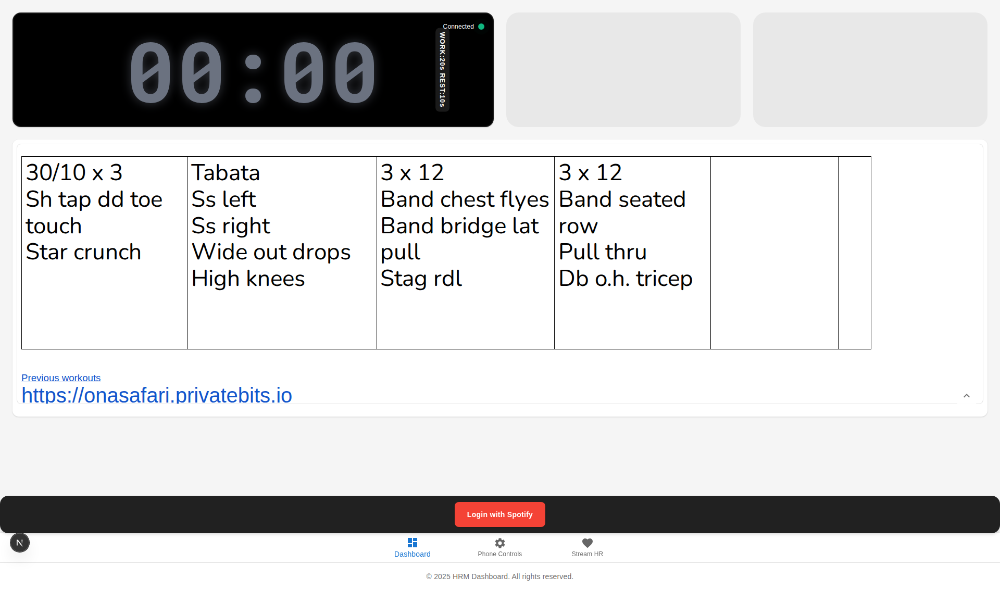
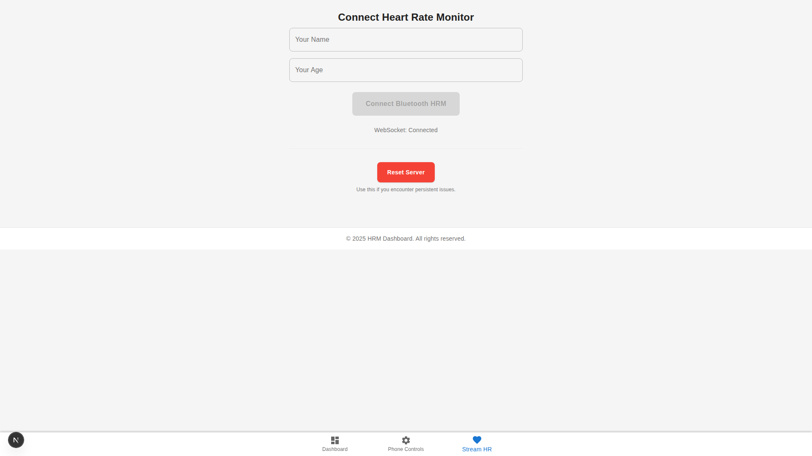
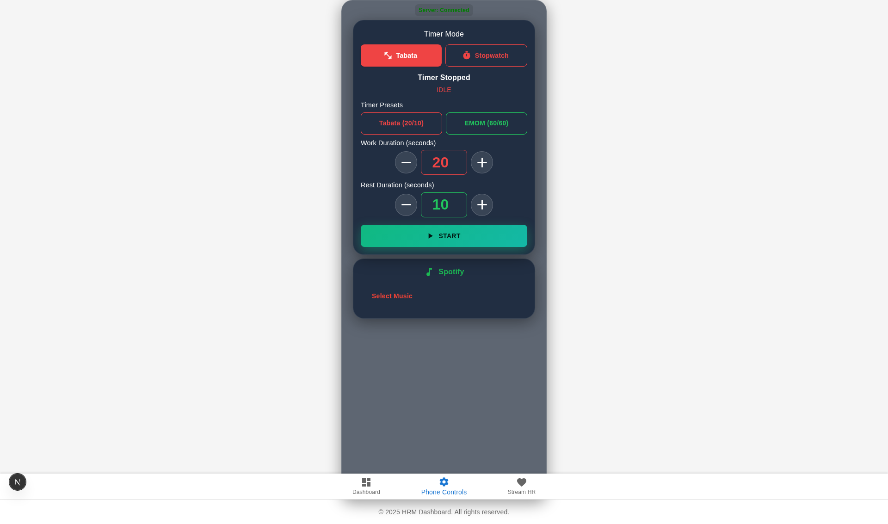
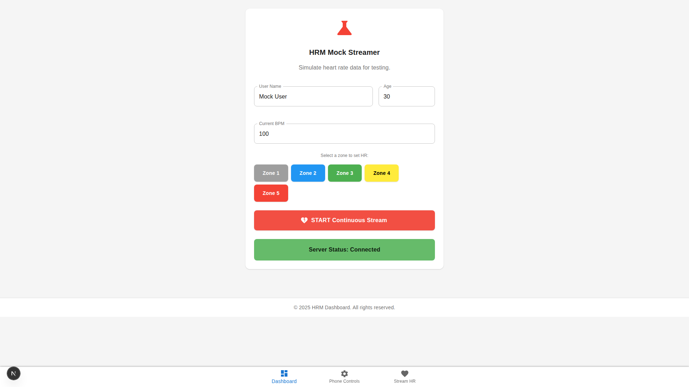
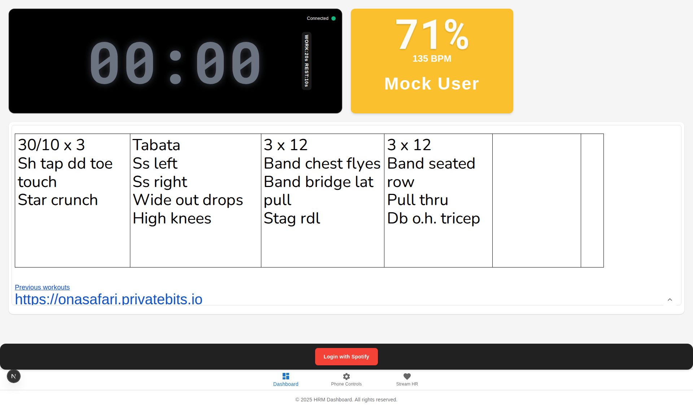
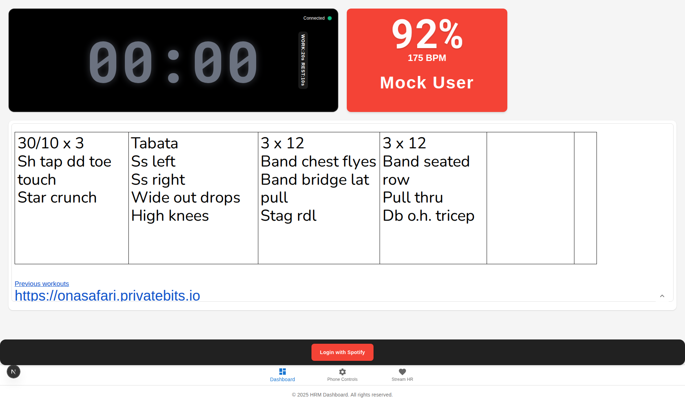

# Getting Started with the HRM Dashboard

This tutorial guides you through the seamless workflow of using the Heart Rate Monitor (HRM) Dashboard, from connection to real-time analysis.

## 1. Connect to the Dashboard

Access the main dashboard. Upon arrival, you will see the overview of the Tabata Timer, empty Heart Rate Tiles, and the Training Regimen.

## 2. Authorize Spotify

To enable music control and playback features, log in with your Spotify account. Click the **"Login with Spotify"** button located at the bottom of the screen.

## 3. Connect Bluetooth Device

Navigate to the connection page (`/client/connect`) to pair your Bluetooth Heart Rate Monitor.

1. Enter your **Name** and **Age**.
2. Click **"Connect Bluetooth HRM"**.
3. Select your device from the browser's Bluetooth picker.

## 4. Control the Timer

Use the Control Panel (`/client/control`) to manage the workout timer. This interface is optimized for mobile devices and allows you to:

- Start, Stop, and Pause the timer.
- Switch between **Tabata** and **Stopwatch** modes.
- Adjust work and rest durations.

## 5. Analyze Heart Rate Zones

The dashboard visualizes heart rate data in real-time, color-coded by intensity zones.

### Simulation with Mock Data

For testing or demonstration, you can use the Mock Client (`/client/mock`) to simulate heart rate data without a physical device.

### Real-Time Visualization

As heart rate data streams in, the dashboard tiles update instantly to reflect the athlete's effort zone.

**Zone 3 (Green - Aerobic):**

**Zone 5 (Red - Maximum Effort):**

