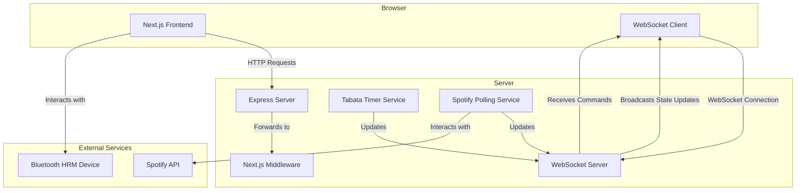

# WebSocket Architecture

This document provides a detailed overview of the WebSocket architecture in this application, covering the key components, the connection lifecycle, and the message flow.

## Core Components

The WebSocket implementation is built around three core components:

-   `WebSocketManager`: A lightweight wrapper around the `ws` library that is responsible for creating the WebSocket server and broadcasting messages to clients.
-   `socketManager`: The central hub for handling WebSocket connections and routing incoming messages to the appropriate services.
-   `ConnectionMonitor`: A utility class that periodically checks for stale connections and terminates them to prevent resource leaks.

These components work together to provide a robust and reliable real-time communication channel between the server and the clients.

## Connection Lifecycle

The WebSocket connection lifecycle is managed by the `socketManager`, which handles the following events:

1.  **Connection Initialization**: When a client connects to the server, the `socketManager` initializes a new session and sends an `INITIAL_STATE` message to the client. This message contains the current state of the application, including the timer data, Spotify data, and HRM data.
2.  **Message Handling**: The `socketManager` listens for incoming messages from the client and routes them to the appropriate services. For example, `TIMER_COMMAND` messages are forwarded to the `TabataTimerService`, while `SPOTIFY_COMMAND` messages are handled by the `SpotifyService`.
3.  **Connection Termination**: When a client disconnects, the `socketManager` waits for a grace period before cleaning up the client's session data. This allows the client to reconnect without losing their data.

## Message Flow

The message flow between the server and the clients is illustrated in the following Mermaid diagram:

This diagram shows how the `WebSocketManager` acts as the central message broker, receiving commands from the clients and broadcasting state updates to all connected clients.

## Reliability and Error Handling

The WebSocket implementation includes several features to ensure reliability and prevent common issues:

-   **Connection Watchdog**: The `ConnectionMonitor` periodically checks for stale connections and terminates them to prevent resource leaks. This is controlled by the `WEBSOCKET_WATCHDOG_INTERVAL` environment variable.
-   **Graceful Reconnection**: When a client disconnects, the server waits for a grace period before cleaning up the session data. This allows the client to reconnect without losing their data and is configured by the `WEBSOCKET_GRACE_PERIOD_MS` environment variable.
-   **Structured Logging**: The WebSocket components use a structured logger to provide detailed information about the connection lifecycle and any errors that occur. This makes it easier to debug issues and monitor the health of the system.

By combining these features, the WebSocket architecture provides a robust and reliable foundation for real-time communication in the application.
