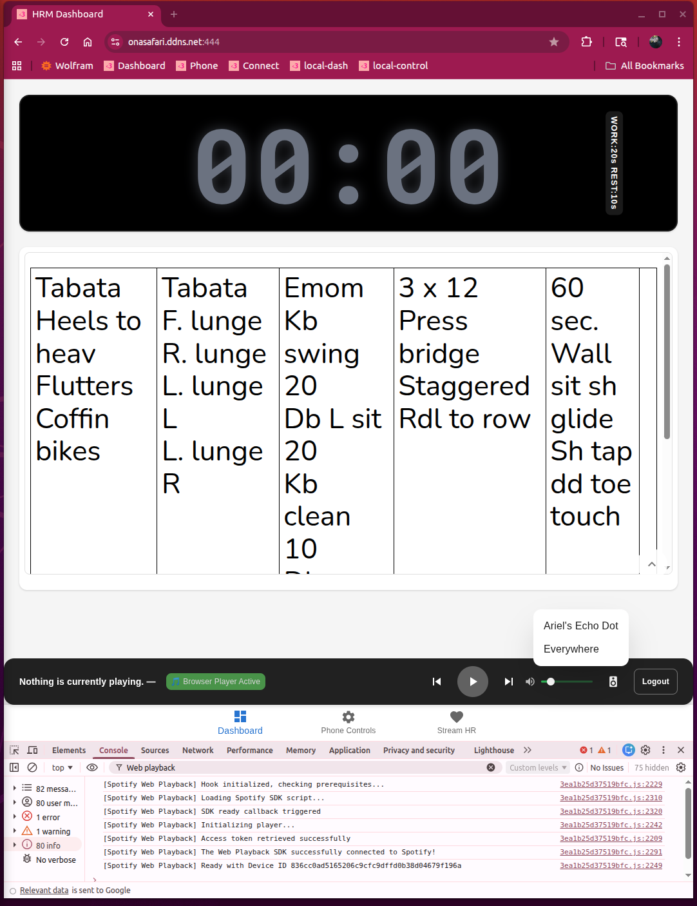

1.  dashboard and /client/control load page automatically sends volume command (even when not authenticated/or active device not selected/detected) so it causes error in logs. Need to prevent that from happening.
    ````
    Socket Client connected: user-36u9shl
    WebSocket Client connected: user-9tmknn8
    GET /api/auth/session 200 in 719ms (compile: 224ms, render: 494ms)
    [socketManager] INCOMING MESSAGE from user-kpwmddh: {"type":"SPOTIFY_COMMAND","command":"SET_VOLUME","volume":23}
    [socketManager] PARSED JSON: { type: 'SPOTIFY_COMMAND', command: 'SET_VOLUME', volume: 23 }
    [socketManager] Received message from user-kpwmddh: SPOTIFY_COMMAND
    Error executing Spotify command SET_VOLUME: Error: Unrecognised response code: 404 - Not Found. Body: {
    "error" : {
     "status" : 404,
     "message" : "Player command failed: No active device found",
     "reason" : "NO_ACTIVE_DEVICE"
    }
    }
     at async SpotifyPolling.executeSpotifyCommand (services/spotifyPolling.ts:262:21)
     at async (services/spotifyPolling.ts:223:17)
    WebSocket Client connected: user-u9jqq6g
     ```
    ````
2.  Pause on spotify /client/control has json paring issue due to token. need to update validation and schema to support the token

    ```

    GET /api/auth/session 200 in 49ms (compile: 36ms, render: 13ms)
    GET /api/auth/session 200 in 18ms (compile: 4ms, render: 14ms)
    GET /api/auth/session 200 in 38ms (compile: 26ms, render: 13ms)
    GET /api/auth/session 200 in 18ms (compile: 4ms, render: 14ms)
    [socketManager] INCOMING MESSAGE from user-8r9dtam: {"type":"SPOTIFY_COMMAND","command":"PAUSE","deviceId":"b0a432de200c202c34f4410521de07fdd468e626"}
    [socketManager] PARSED JSON: {
    type: 'SPOTIFY_COMMAND',
    command: 'PAUSE',
    deviceId: 'b0a432de200c202c34f4410521de07fdd468e626'
    }
    [socketManager] Received message from user-8r9dtam: SPOTIFY_COMMAND
    Error executing Spotify command PAUSE: SyntaxError: SyntaxError: Unexpected token 'L', "LifaQo1K7Z"... is not valid JSON
    at JSON.parse (<anonymous>)
    at async SpotifyPolling.executeSpotifyCommand (services/spotifyPolling.ts:246:17)
    at async (services/spotifyPolling.ts:223:17)

    ```

3.  'HRM web player doesn't show up' when opening dashboard . The device list doesn't get reloaded until you do a manual refresh. Note in dashboard console logs the device ic clearly authenticated with spotify and has device id

```
[Spotify Web Playback] Hook initialized, checking prerequisites...
3ea1b25d37519bfc.js:2310 [Spotify Web Playback] Loading Spotify SDK script...
3ea1b25d37519bfc.js:2320 [Spotify Web Playback] SDK ready callback triggered
3ea1b25d37519bfc.js:2242 [Spotify Web Playback] Initializing player...
3ea1b25d37519bfc.js:2209 [Spotify Web Playback] Access token retrieved successfully
3ea1b25d37519bfc.js:2291 [Spotify Web Playback] The Web Playback SDK successfully connected to Spotify!
3ea1b25d37519bfc.js:2249 [Spotify Web Playback] Ready with Device ID 836cc0ad5165206c9cfc9dffd0b38d04679f196a
```

4. On /client/control page pause has an error even though device id is selected:

```
[socketManager] Received message from user-agw0uxx: SPOTIFY_COMMAND
[socketManager] INCOMING MESSAGE from user-3t2b7xq: {"type":"SPOTIFY_COMMAND","command":"PAUSE","deviceId":"836cc0ad5165206c9cfc9dffd0b38d04679f196a"}
[socketManager] PARSED JSON: {
  type: 'SPOTIFY_COMMAND',
  command: 'PAUSE',
  deviceId: '836cc0ad5165206c9cfc9dffd0b38d04679f196a'
}
[socketManager] Received message from user-3t2b7xq: SPOTIFY_COMMAND
Error executing Spotify command PAUSE: SyntaxError: SyntaxError: Unexpected token 'z', "za6j9tLejg"... is not valid JSON
    at JSON.parse (<anonymous>)
    at async SpotifyPolling.executeSpotifyCommand (dist/services/spotifyPolling.js:246:17)
    at async (dist/services/spotifyPolling.js:223:17)

5. Lots of messages state update messages without relevant information on /client/control page:
 dcb33ac75827aea5.js:504 [useWebSocket] Connected to server
dcb33ac75827aea5.js:532 [useWebSocket] Received STATE_UPDATE. HRM Data: Array(5)
dcb33ac75827aea5.js:504 [useWebSocket] Connected to server
dcb33ac75827aea5.js:532 [useWebSocket] Received STATE_UPDATE. HRM Data: Array(6)
dcb33ac75827aea5.js:564 [useWebSocket] Sending: Object
dcb33ac75827aea5.js:504 [useWebSocket] Connected to server
dcb33ac75827aea5.js:532 [useWebSocket] Received STATE_UPDATE. HRM Data: Array(7)
dcb33ac75827aea5.js:504 [useWebSocket] Connected to server
dcb33ac75827aea5.js:532 [useWebSocket] Received STATE_UPDATE. HRM Data: Array(8)
8e8e9b63b1b876bd.js:2806 User interaction detected, initializing audio...
dcb33ac75827aea5.js:564 [useWebSocket] Sending: Object
dcb33ac75827aea5.js:564 [useWebSocket] Sending: Object
dcb33ac75827aea5.js:532 [useWebSocket] Received STATE_UPDATE. HRM Data: undefined
dcb33ac75827aea5.js:532 [useWebSocket] Received STATE_UPDATE. HRM Data: undefined
dcb33ac75827aea5.js:532 [useWebSocket] Received STATE_UPDATE. HRM Data: undefined
dcb33ac75827aea5.js:532 [useWebSocket] Received STATE_UPDATE. HRM Data: undefined
dcb33ac75827aea5.js:564 [useWebSocket] Sending: {type: 'SPOTIFY_COMMAND', command: 'PAUSE', deviceId: '836cc0ad5165206c9cfc9dffd0b38d04679f196a'}command: "PAUSE"deviceId: "836cc0ad5165206c9cfc9dffd0b38d04679f196a"type: "SPOTIFY_COMMAND"[[Prototype]]: Object
dcb33ac75827aea5.js:564 [useWebSocket] Sending: {type: 'SPOTIFY_COMMAND', command: 'PAUSE', deviceId: '836cc0ad5165206c9cfc9dffd0b38d04679f196a'}
dcb33ac75827aea5.js:509 [useWebSocket] Disconnected from server 1006
dcb33ac75827aea5.js:509 [useWebSocket] Disconnected from server 1006
dcb33ac75827aea5.js:509 [useWebSocket] Disconnected from server 1006
dcb33ac75827aea5.js:532 [useWebSocket] Received STATE_UPDATE. HRM Data: (7) [{…}, {…}, {…}, {…}, {…}, {…}, {…}]
dcb33ac75827aea5.js:532 [useWebSocket] Received STATE_UPDATE. HRM Data: (6) [{…}, {…}, {…}, {…}, {…}, {…}]
dcb33ac75827aea5.js:532 [useWebSocket] Received STATE_UPDATE. HRM Data: (5) [{…}, {…}, {…}, {…}, {…}]
dcb33ac75827aea5.js:532 [useWebSocket] Received STATE_UPDATE. HRM Data: (4) [{…}, {…}, {…}, {…}]
dcb33ac75827aea5.js:532 [useWebSocket] Received STATE_UPDATE. HRM Data: (3) [{…}, {…}, {…}]
dcb33ac75827aea5.js:532 [useWebSocket] Received STATE_UPDATE. HRM Data: (2) [{…}, {…}]
dcb33ac75827aea5.js:532 [useWebSocket] Received STATE_UPDATE. HRM Data: [{…}]
dcb33ac75827aea5.js:518 [useWebSocket] Attempting to reconnect...
dcb33ac75827aea5.js:518 [useWebSocket] Attempting to reconnect...
dcb33ac75827aea5.js:504 [useWebSocket] Connected to server
dcb33ac75827aea5.js:532 [useWebSocket] Received STATE_UPDATE. HRM Data: (2) [{…}, {…}]
dcb33ac75827aea5.js:518 [useWebSocket] Attempting to reconnect...
dcb33ac75827aea5.js:504 [useWebSocket] Connected to server
dcb33ac75827aea5.js:532 [useWebSocket] Received STATE_UPDATE. HRM Data: (3) [{…}, {…}, {…}]
dcb33ac75827aea5.js:504 [useWebSocket] Connected to server
dcb33ac75827aea5.js:532 [useWebSocket] Received STATE_UPDATE. HRM Data: (4) [{…}, {…}, {…}, {…}]0: age: 30clientId: "user-3t2b7xq"maxHr: 185value: 0[[Prototype]]: Object1: {clientId: 'user-czhhwvt', value: 0, maxHr: 185, age: 30}2: {clientId: 'user-77onjm1', value: 0, maxHr: 185, age: 30}3: {clientId: 'user-hl73djk', value: 0, maxHr: 185, age: 30}length: 4[[Prototype]]: Array(0)
dcb33ac75827aea5.js:564 [useWebSocket] Sending: {type: 'SPOTIFY_COMMAND', command: 'PAUSE', deviceId: '836cc0ad5165206c9cfc9dffd0b38d04679f196a'}command: "PAUSE"deviceId: "836cc0ad5165206c9cfc9dffd0b38d04679f196a"type: "SPOTIFY_COMMAND"[[Prototype]]: Object
dcb33ac75827aea5.js:564 [useWebSocket] Sending: {type: 'TIMER_CONFIG', workDuration: 20, restDuration: 10}
dcb33ac75827aea5.js:564 [useWebSocket] Sending: {type: 'TIMER_COMMAND', command: 'START'}
dcb33ac75827aea5.js:564 [useWebSocket] Sending: {type: 'SPOTIFY_COMMAND', command: 'NEXT', deviceId: '836cc0ad5165206c9cfc9dffd0b38d04679f196a'}command: "NEXT"deviceId: "836cc0ad5165206c9cfc9dffd0b38d04679f196a"type: "SPOTIFY_COMMAND"[[Prototype]]: Object
dcb33ac75827aea5.js:532 [useWebSocket] Received STATE_UPDATE. HRM Data: undefined
dcb33ac75827aea5.js:532 [useWebSocket] Received STATE_UPDATE. HRM Data: undefined
dcb33ac75827aea5.js:532 [useWebSocket] Received STATE_UPDATE. HRM Data: undefined
dcb33ac75827aea5.js:532 [useWebSocket] Received STATE_UPDATE. HRM Data: undefined
dcb33ac75827aea5.js:532 [useWebSocket] Received STATE_UPDATE. HRM Data: undefined
dcb33ac75827aea5.js:532 [useWebSocket] Received STATE_UPDATE. HRM Data: undefined
dcb33ac75827aea5.js:532 [useWebSocket] Received STATE_UPDATE. HRM Data: undefined
dcb33ac75827aea5.js:532 [useWebSocket] Received STATE_UPDATE. HRM Data: undefined
dcb33ac75827aea5.js:532 [useWebSocket] Received STATE_UPDATE. HRM Data: undefined
dcb33ac75827aea5.js:532 [useWebSocket] Received STATE_UPDATE. HRM Data: undefined
dcb33ac75827aea5.js:532 [useWebSocket] Received STATE_UPDATE. HRM Data: undefined
dcb33ac75827aea5.js:532 [useWebSocket] Received STATE_UPDATE. HRM Data: undefined
dcb33ac75827aea5.js:532 [useWebSocket] Received STATE_UPDATE. HRM Data: undefined
dcb33ac75827aea5.js:532 [useWebSocket] Received STATE_UPDATE. HRM Data: undefined
dcb33ac75827aea5.js:532 [useWebSocket] Received STATE_UPDATE. HRM Data: undefined
dcb33ac75827aea5.js:532 [useWebSocket] Received STATE_UPDATE. HRM Data: undefined
dcb33ac75827aea5.js:532 [useWebSocket] Received STATE_UPDATE. HRM Data: undefined
dcb33ac75827aea5.js:532 [useWebSocket] Received STATE_UPDATE. HRM Data: undefined
dcb33ac75827aea5.js:532 [useWebSocket] Received STATE_UPDATE. HRM Data: undefined
dcb33ac75827aea5.js:532 [useWebSocket] Received STATE_UPDATE. HRM Data: undefined
dcb33ac75827aea5.js:532 [useWebSocket] Received STATE_UPDATE. HRM Data: undefined
dcb33ac75827aea5.js:532 [useWebSocket] Received STATE_UPDATE. HRM Data: undefined
dcb33ac75827aea5.js:532 [useWebSocket] Received STATE_UPDATE. HRM Data: undefined
dcb33ac75827aea5.js:532 [useWebSocket] Received STATE_UPDATE. HRM Data: undefined
dcb33ac75827aea5.js:532 [useWebSocket] Received STATE_UPDATE. HRM Data: undefined
dcb33ac75827aea5.js:532 [useWebSocket] Received STATE_UPDATE. HRM Data: undefined
dcb33ac75827aea5.js:532 [useWebSocket] Received STATE_UPDATE. HRM Data: undefined
dcb33ac75827aea5.js:532 [useWebSocket] Received STATE_UPDATE. HRM Data: undefined
dcb33ac75827aea5.js:532 [useWebSocket] Received STATE_UPDATE. HRM Data: undefined
dcb33ac75827aea5.js:532 [useWebSocket] Received STATE_UPDATE. HRM Data: undefined
dcb33ac75827aea5.js:532 [useWebSocket] Received STATE_UPDATE. HRM Data: undefined
dcb33ac75827aea5.js:532 [useWebSocket] Received STATE_UPDATE. HRM Data: undefined
dcb33ac75827aea5.js:532 [useWebSocket] Received STATE_UPDATE. HRM Data: undefined
.....
```

5. validation errors using start/stop button on /client/control page

```
 deviceId: '836cc0ad5165206c9cfc9dffd0b38d04679f196a'
}
[socketManager] Received message from user-3t2b7xq: SPOTIFY_COMMAND
Error executing Spotify command PAUSE: SyntaxError: SyntaxError: Unexpected non-whitespace character after JSON at position 4 (line 1 column 5)
  at JSON.parse (<anonymous>)
  at async SpotifyPolling.executeSpotifyCommand (dist/services/spotifyPolling.js:246:17)
  at async (dist/services/spotifyPolling.js:223:17)
Loaded Spotify tokens for: 1282365133
[socketManager] INCOMING MESSAGE from user-czhhwvt: {"type":"TIMER_CONFIG","workDuration":20,"restDuration":10}
[socketManager] PARSED JSON: { type: 'TIMER_CONFIG', workDuration: 20, restDuration: 10 }
[socketManager] Received message from user-czhhwvt: TIMER_CONFIG
[socketManager] INCOMING MESSAGE from user-czhhwvt: {"type":"TIMER_COMMAND","command":"START"}
[socketManager] PARSED JSON: { type: 'TIMER_COMMAND', command: 'START' }
[socketManager] Received message from user-czhhwvt: TIMER_COMMAND
[socketManager] INCOMING MESSAGE from user-czhhwvt: {"type":"SPOTIFY_COMMAND","command":"NEXT","deviceId":"836cc0ad5165206c9cfc9dffd0b38d04679f196a"}
[socketManager] PARSED JSON: {
type: 'SPOTIFY_COMMAND',
command: 'NEXT',
deviceId: '836cc0ad5165206c9cfc9dffd0b38d04679f196a'
}
[socketManager] Received message from user-czhhwvt: SPOTIFY_COMMAND
Error executing Spotify command NEXT: SyntaxError: SyntaxError: Unexpected token 'j', "jeX86V88LF"... is not valid JSON
  at JSON.parse (<anonymous>)
  at async SpotifyPolling.executeSpotifyCommand (dist/services/spotifyPolling.js:249:17)
  at async (dist/services/spotifyPolling.js:223:17)
[socketManager] INCOMING MESSAGE from user-czhhwvt: {"type":"TIMER_COMMAND","command":"STOP"}
[socketManager] PARSED JSON: { type: 'TIMER_COMMAND', command: 'STOP' }
[socketManager] Received message from user-czhhwvt: TIMER_COMMAND
[socketManager] INCOMING MESSAGE from user-czhhwvt: {"type":"SPOTIFY_COMMAND","command":"PAUSE","deviceId":"836cc0ad5165206c9cfc9dffd0b38d04679f196a"}
[socketManager] PARSED JSON: {
type: 'SPOTIFY_COMMAND',
command: 'PAUSE',
deviceId: '836cc0ad5165206c9cfc9dffd0b38d04679f196a'
}
[socketManager] Received message from user-czhhwvt: SPOTIFY_COMMAND
Error executing Spotify command PAUSE: SyntaxError: SyntaxError: Unexpected token 'e', "eTi5dXz23Y"... is not valid JSON
  at JSON.parse (<anonymous>)
  at async SpotifyPolling.executeSpotifyCommand (dist/services/spotifyPolling.js:246:17)
  at async (dist/services/spotifyPolling.js:223:17)
[socketManager] INCOMING MESSAGE from user-czhhwvt: {"type":"TIMER_CONFIG","workDuration":20,"restDuration":10}
[socketManager] PARSED JSON: { type: 'TIMER_CONFIG', workDuration: 20, restDuration: 10 }
[socketManager] Received message from user-czhhwvt: TIMER_CONFIG
[socketManager] INCOMING MESSAGE from user-czhhwvt: {"type":"TIMER_COMMAND","command":"START"}
[socketManager] PARSED JSON: { type: 'TIMER_COMMAND', command: 'START' }
[socketManager] Received message from user-czhhwvt: TIMER_COMMAND
[socketManager] INCOMING MESSAGE from user-czhhwvt: {"type":"SPOTIFY_COMMAND","command":"NEXT","deviceId":"836cc0ad5165206c9cfc9dffd0b38d04679f196a"}
[socketManager] PARSED JSON: {
type: 'SPOTIFY_COMMAND',
command: 'NEXT',
deviceId: '836cc0ad5165206c9cfc9dffd0b38d04679f196a'
}
[socketManager] Received message from user-czhhwvt: SPOTIFY_COMMAND
Error executing Spotify command NEXT: SyntaxError: SyntaxError: Unexpected token 'V', "Vpp0socsJa"... is not valid JSON
  at JSON.parse (<anonymous>)
  at async SpotifyPolling.executeSpotifyCommand (dist/services/spotifyPolling.js:249:17)
  at async (dist/services/spotifyPolling.js:223:17)
[socketManager] INCOMING MESSAGE from user-czhhwvt: {"type":"TIMER_COMMAND","command":"STOP"}
[socketManager] PARSED JSON: { type: 'TIMER_COMMAND', command: 'STOP' }
[socketManager] Received message from user-czhhwvt: TIMER_COMMAND
[socketManager] INCOMING MESSAGE from user-czhhwvt: {"type":"SPOTIFY_COMMAND","command":"PAUSE","deviceId":"836cc0ad5165206c9cfc9dffd0b38d04679f196a"}
[socketManager] PARSED JSON: {
type: 'SPOTIFY_COMMAND',
command: 'PAUSE',
deviceId: '836cc0ad5165206c9cfc9dffd0b38d04679f196a'
}
[socketManager] Received message from user-czhhwvt: SPOTIFY_COMMAND
Error executing Spotify command PAUSE: SyntaxError: SyntaxError: Unexpected token 'm', "m5Jj0z8ji7"... is not valid JSON
  at JSON.parse (<anonymous>)
  at async SpotifyPolling.executeSpotifyCommand (dist/services/spotifyPolling.js:246:17)
  at async (dist/services/spotifyPolling.js:223:17)
```
